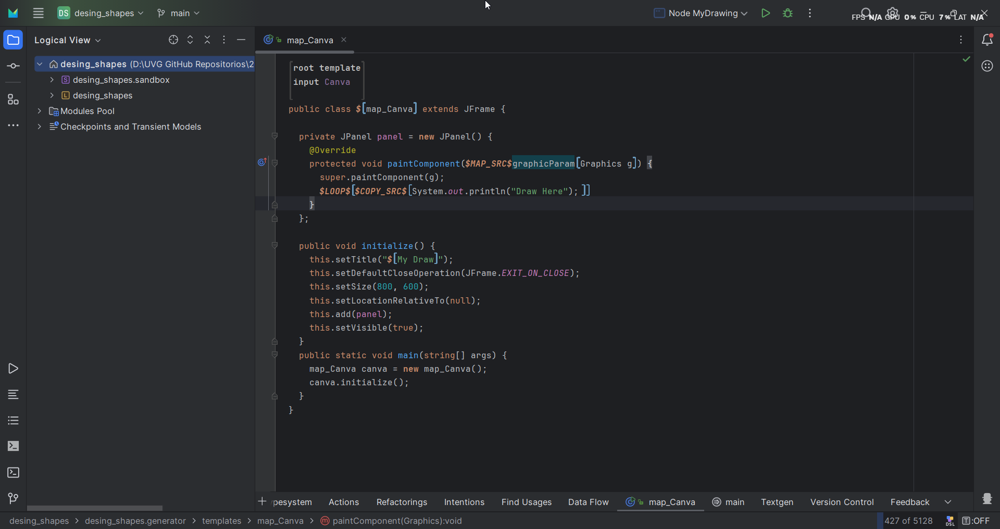
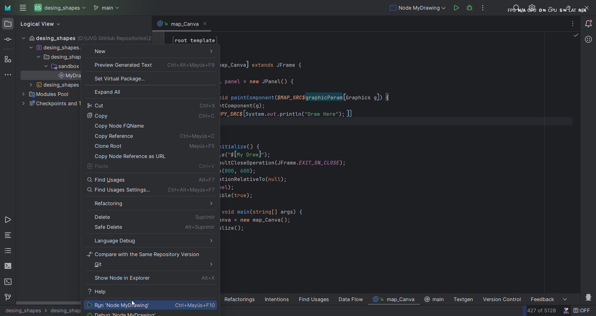
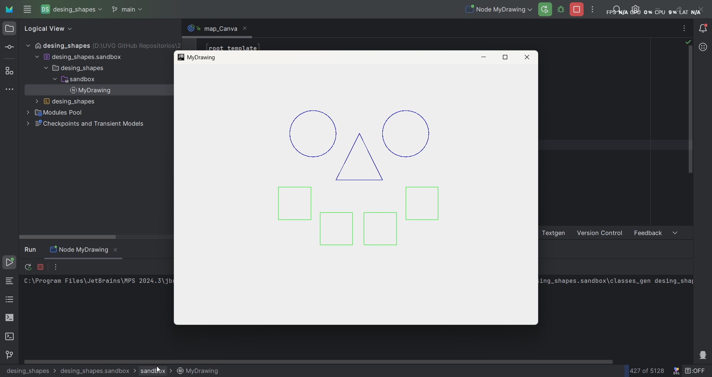
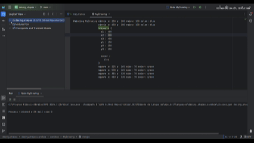

# Diseño de DSL con JetBrains MPS 💡

Esta actividad se realizó utilizando la aplicación **JetBrains MPS** para crear un **DSL** (Lenguaje Específico de Dominio) de figuras geométricas (círculo, cuadrado y triángulo). Se emplearon conceptos y generadores para definir los atributos y comportamientos de cada figura, minimizando casi por completo el uso de lenguaje **Java**.

## 💻 Entorno

- **Aplicación**: JetBrains MPS
- **Versión**: 2024.3

## 📜 Instrucciones

- Clonar el repositorio:
  - HTTPS:

    ```bash
    git clone https://github.com/JosueSay/LenguageDesign
    ```

  - SSH:

    ```bash
    git clone git@github.com:JosueSay/LenguageDesign.git
    ```

- Abrir **JetBrains MPS**.  
- Crear un nuevo proyecto y abrir la carpeta `mps_dsl` del repositorio clonado.  

    

### Ejecutar el Proyecto  

- En la carpeta `design_shapes.sandbox`, haz clic derecho sobre **"MyDrawing"**.  
- Selecciona la opción **"Run 'Node My Drawing'"**.  

    

### Resultado

Se abrirá un lienzo mostrando un dibujo de una cara compuesta por:

- **2 círculos**  
- **1 triángulo**  
- **4 cuadrados**  

**Ejemplo del dibujo:**  
  

## ✏️ Edición de Formas

Puedes editar el dibujo haciendo doble clic en **"MyDrawing"** en la carpeta `design_shapes.sandbox`.  

### Opciones de Edición

- **Círculos:**  
  - Posición `(x, y)`  
  - Radio  
  - Color *(black, blue, cyan, green, red, white, yellow)*  
- **Cuadrados:**  
  - Posición `(x, y)`  
  - Tamaño  
  - Color  
- **Triángulos:**  
  - Posición `(x, y)` de cada vértice  
  - Color  

  

## 🎥 Multimedia

### Demostración

[Enlace a demostración en YouTube](https://youtu.be/uvFARz-BhMM)

### Explicación

[Enlace a explicativo en YouTube](https://youtu.be/g3ZbE7eq4qw)
